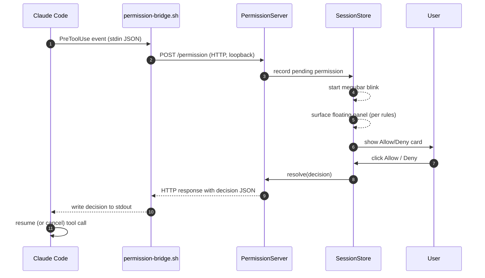

# Claude Sessions

A macOS menubar app that surfaces your active [Claude Code](https://docs.anthropic.com/en/docs/claude-code) sessions, pipes permission prompts to a native UI, and pops an always-on-top panel when a session needs you.

See which sessions are running, answer Allow/Deny without leaving your current window, read message history live, and jump to the exact terminal/IDE window hosting any session — all without context-switching to the terminal that spawned Claude.

## Features

### Session visibility

- **Session list** grouped by project, sorted by last activity, with search across project, path, preview, and session id.
- **Status filter pills**: a combined **Active** group (Running · Pending · Idle) plus **Done** and **Error**. Counts update in real time.
- **Age filter** for Done sessions: last 1h / 6h / 24h / 3d / 7d.
- **Live message history** — click a row to open a dedicated window that streams new messages as Claude writes them to disk (FS events + 0.5 s polling fallback).
- **Focus the terminal** hosting a session. For iTerm2 and Terminal.app, the specific tab is selected by TTY. For IDE terminals (Cursor, VSCode, etc.), the correct instance and workspace window is raised via the Accessibility API.
- **Send a message via the Claude bridge** — if you've run `/remote-control` in a session, a paperplane button opens `https://claude.ai/code/<bridgeSessionId>` in your browser.
- **Newest-first history** with user / assistant / tool_use / tool_result / thinking / system entries all rendered with distinct styling.
- Right-click any row for a quick menu: Open History · Focus Terminal · Send Message · Reveal Transcript in Finder · Copy Session ID.

### Permission prompts in the menubar

- **PreToolUse hook bridge** — when Claude wants to run a Bash/Write/Edit/WebFetch/Task tool, instead of the terminal prompt you get a native card in the app, with the tool name and arguments.
- **Allow / Deny in-app** — one click resolves the prompt. Claude never blocks on the terminal prompt you'd otherwise have to tab to.
- **Informational mode** — toggle Allow/Deny off and cards become read-only notices; the terminal prompt answers as usual. The card self-dismisses after 30 seconds.
- **Rule-aware** — reads `~/.claude/settings.json` `permissions.allow` / `permissions.deny` and auto-resolves matching calls without bothering you. Supports bare tool names (`Bash`) and Bash prefix rules (`Bash(git status:*)`).
- **Graceful fallback** — if the app is down or the hook can't reach it, the bridge responds `ask` so Claude Code falls back to its own terminal prompt. You never get silently denied.

### Floating panel

- **Always-on-top panel** (`500×500`) with the full session list, searchable and filterable.
- **Compact pill mode** — collapse the panel to a 260×44 pill showing active count, pending badge, headline session, and an expand button.
- **Auto-surface on attention** — the panel expands from pill → main automatically when Claude finishes a turn, when a permission arrives, on error, or on session-end. Configurable (see Settings).
- **Runs on all Spaces** and over full-screen windows; non-activating, so it doesn't steal focus.
- **Position persisted** per-panel (main and pill remember their own origin).

### Menubar label

- **Sparkle icon** with live active-count badge.
- **Blink** when attention is needed (permission arriving, error, turn-end) — 0.5 s toggle for up to 6 s.

## How it works

The app is a **read-only observer** of Claude Code's on-disk state, plus a loopback HTTP server that receives hook POSTs from Claude Code. It never modifies your transcripts or talks to the Claude API.

### On-disk sources

| Source | Purpose |
|---|---|
| `~/.claude/sessions/<pid>.json` | Live-session pointer. Presence + live PID = session is running. Also contains the `bridgeSessionId` when `/remote-control` is active. |
| `~/.claude/projects/<encoded-cwd>/<sessionId>.jsonl` | Full message transcript. Tailed for list preview; read fully for the history window. |
| `~/.claude/ide/*.lock` | One per connected IDE *window* — lets us match a session's cwd to a specific Cursor/VSCode window for precise focus. |
| `~/.claude/settings.json` | Read for `permissions.allow` / `permissions.deny` rules, and written to install/uninstall our hook entries. |
| `~/.claude/menubar/port` | Written by the app when the permission server binds; read by the bridge script to know where to POST. |
| `~/.claude/menubar/permission-bridge.sh` | Shell script **written by the app on Install** (embedded in `HookInstaller.swift`, not checked into the repo) that Claude Code invokes as the hook command; POSTs to our server and writes the response to stdout. |

### Hook pipeline



Two endpoints:

- **`POST /permission`** — PreToolUse. The request blocks until the user answers (or the 95 s timeout fires, whichever comes first). Response body is `{"hookSpecificOutput":{"hookEventName":"PreToolUse","permissionDecision":"allow"|"deny"|"ask"}}`.
- **`POST /stop`** — Stop hook. Fire-and-forget. The app uses it to detect turn-end and auto-surface the panel.

The server binds to `127.0.0.1` on an ephemeral port and publishes that port to `~/.claude/menubar/port`. The bridge re-reads the file on every invocation, so the port can change across app restarts without re-installing the hook.

### Hook install/uninstall

**Why install the hook?** Without it, the app is a passive viewer — it can list sessions and read transcripts, but Claude Code will still ask for permissions in the terminal and the app will never know when a turn ends. Installing the hook is what turns on the active features:

- **In-app Allow/Deny cards** — the PreToolUse hook is how Claude Code hands the prompt to this app instead of printing it in the terminal. Without the hook installed, there is no prompt to click.
- **Auto-surface on turn-end** — the Stop hook tells the app when an agent just finished replying, which drives the panel pop-up and menubar blink.
- **Rule-aware auto-resolve** — matching `permissions.allow` / `permissions.deny` only kicks in for calls that flow through our hook.

You can uninstall at any time without losing your `settings.json` — only the `_source`-stamped entries this app added get removed.

Clicking **Install Permission Hook** from the gear menu rewrites `~/.claude/settings.json` to add two entries under `hooks`:

```jsonc
{
  "hooks": {
    "PreToolUse": [{
      "matcher": "Bash|Write|Edit|MultiEdit|NotebookEdit|WebFetch|Task",
      "hooks": [{ "type": "command", "command": ".../permission-bridge.sh", "timeout": 120 }],
      "_source": "claude-sessions-menubar"
    }],
    "Stop": [{
      "hooks": [{ "type": "command", "command": ".../permission-bridge.sh", "timeout": 30 }],
      "_source": "claude-sessions-menubar"
    }]
  }
}
```

- **`_source` stamp** lets the app find its own entries without touching yours. Uninstall removes only stamped entries.
- **Upgrade-on-launch**: if you already installed the hook, the app re-stamps its entries on every launch so matcher/timeout changes ship with app updates without a manual reinstall.
- **Auto-allowed tools** (Read, Grep, Glob, LS) are deliberately excluded from the matcher so the menubar isn't spammed with prompts you'd never want to see.
- **Settings file safety** — if `settings.json` exists but isn't valid JSON, Install refuses rather than overwriting.

### Status rules

| Status | Condition |
|---|---|
| **Running** | Live PID alive **and** last transcript entry is an assistant message within 2 minutes |
| **Pending** | Live PID alive **and** last entry is a user message or tool_result (Claude is idle / awaiting hook) |
| **Idle** | Live PID alive **and** no transcript activity for 2+ minutes |
| **Done** | No live PID; transcript modified within the last 7 days |
| **Error** | Recent `tool_result` with `is_error: true` (overrides other statuses) |

Sessions whose transcript hasn't been touched in 7+ days are excluded entirely.

### Floating-panel surface rules

When the app has reason to pull your attention — permission, turn-end, error, session-done — it decides whether to open the panel based on two settings and the current panel state:

| Event | `Always Open Floating Panel` ON | OFF + `Allow/Deny in App` ON | OFF + `Allow/Deny in App` OFF |
|---|---|---|---|
| Permission request | Force-open main | Force-open main | Surface only if already open |
| Turn-end / error / session-done | Force-open main | Surface only if already open | Surface only if already open |

**Surface-only-if-already-open** means: if the panel was collapsed to a pill, expand it to the main view; if it was fully closed, do nothing (the menubar icon still blinks). The idea is to avoid resurrecting a window you deliberately dismissed, except when a permission literally can't be answered any other way.

## Settings (gear menu)

- **Allow/Deny in App** (default **on**). When on, cards have Allow/Deny buttons and resolution happens in the app. When off, the hook responds `ask` immediately so Claude's terminal prompt fires; the card stays as a read-only notice and auto-dismisses after 30 s.
- **Always Open Floating Panel** (default **off**). When on, every attention event pops the main floating panel. See the table above.
- **Install / Uninstall Permission Hook**. Toggle between the two states. Uninstall only removes the `_source`-stamped entries this app added.
- **Quit**.

## Requirements

- macOS 14 (Sonoma) or later
- [Xcode 15+](https://developer.apple.com/xcode/) (the command-line tools alone aren't enough for `MenuBarExtra`)
- [XcodeGen](https://github.com/yonaskolb/XcodeGen) (to regenerate the project from `project.yml`)

## Setup

```sh
brew install xcodegen
git clone https://github.com/akash705/claude-sessions-menubar.git
cd claude-sessions-menubar
xcodegen generate
open ClaudeSessions.xcodeproj
```

In Xcode:

1. Select the `ClaudeSessions` target → **Signing & Capabilities** → pick your team (or *Sign to Run Locally*).
2. Hit **⌘R**. A ✨ icon appears in the menubar.
3. Click the gear → **Install Permission Hook** to route PreToolUse prompts through the app.

## Permissions

On first use of "Focus Terminal" for an IDE session, macOS will prompt for **Accessibility** access. Grant it in:

**System Settings → Privacy & Security → Accessibility**

This is only needed to raise the correct IDE *window* (Cursor, VSCode, etc.) when you have multiple open. Standalone terminals (iTerm2, Terminal.app) use AppleScript instead and don't need Accessibility.

No outbound network — the permission server binds to loopback only and is never exposed beyond 127.0.0.1.

## Project layout

```
ClaudeSessions/
├── ClaudeSessionsApp.swift           # @main — MenuBarExtra + history WindowGroup
├── Models/
│   ├── Session.swift                 # Session struct + SessionStatus enum
│   ├── TranscriptEntry.swift         # JSONL line + content-block decoder
│   └── PendingPermission.swift       # In-flight permission + hook response shape
├── Services/
│   ├── ClaudePaths.swift             # ~/.claude/* URL helpers
│   ├── LiveSessionIndex.swift        # reads ~/.claude/sessions/*.json
│   ├── IDEIndex.swift                # reads ~/.claude/ide/*.lock
│   ├── TranscriptReader.swift        # backward-chunked JSONL tail + full read
│   ├── SessionScanner.swift          # walks projects/, builds [Session]
│   ├── StatusResolver.swift          # the status rules above
│   ├── ProcessLiveness.swift         # kill(pid, 0)
│   ├── ProcessTree.swift             # libproc ppid walk, finds host .app
│   ├── TerminalFocuser.swift         # activate + AppleScript/AX window raise
│   ├── FileWatcher.swift             # DispatchSource debounced directory watcher
│   ├── PermissionServer.swift        # Loopback HTTP server for /permission + /stop
│   ├── PermissionRuleMatcher.swift   # Consults settings.json allow/deny
│   ├── HookInstaller.swift           # Writes bridge script + settings.json entries
│   └── FloatingPanelController.swift # NSPanel lifecycle (main + pill), surface logic
├── Stores/
│   └── SessionStore.swift            # @Published sessions, filters, pending perms, prefs
└── Views/
    ├── MenuBarContent.swift          # Popover + shared body reused by floating panel
    ├── FloatingPanelContent.swift    # Main floating-panel root + titlebar
    ├── CompactPillView.swift         # Pill view
    ├── FilterBar.swift               # Status pills + age filter
    ├── SessionRow.swift              # List row + permission card
    └── HistoryWindow.swift           # Message history window
```

## Caveats / not yet supported

- **Permission rule matcher** handles bare tool names and `Bash(prefix:*)` only. Path globs, URL patterns, and nested specs fall through to the UI (which is usually the right default).
- **No send-message fallback** for sessions without an active bridge. The `paperplane` button only appears when `bridgeSessionId` is set (i.e. you've run `/remote-control`). AppleScript keystroke injection was considered but deliberately skipped — too fragile.
- **Per-tab precision** only works for iTerm2 and Terminal.app. Cursor/VSCode get correct-window precision (via the IDE lock files + AX). Warp, Ghostty, WezTerm get app-level activation only.
- **Subagent transcripts** (under `<sessionId>/subagents/`) aren't aggregated in the main timeline yet — only the parent session's transcript is shown.
- **Task viewer** for `~/.claude/tasks/` isn't built yet.
- **MenuBarExtra popover can't be opened programmatically** (SwiftUI limitation). That's why permission events force-open the floating panel — it's the only UI the app can pop up by itself.

## License

MIT
